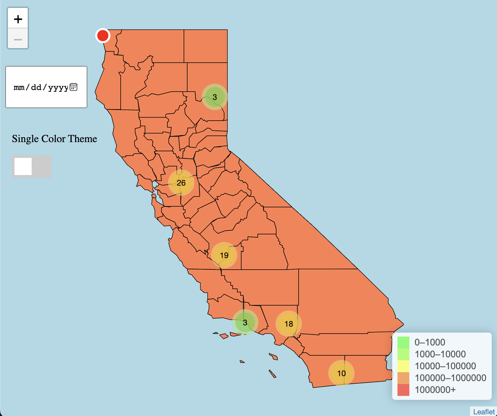
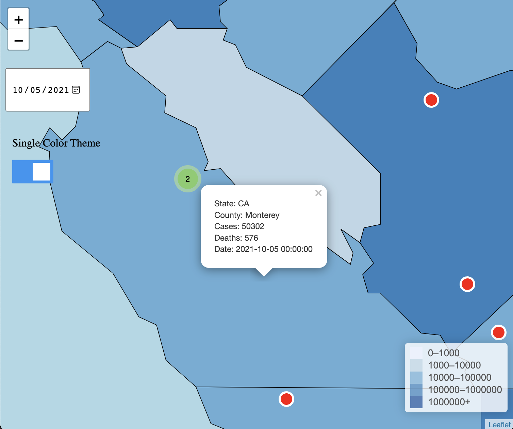

# Covid-19 Data Visualizer

## Description
This application provides a visualization of case counts in California counties and prison facilities spanning from January 2020 to November 2021. Users can select a specific date, and the application will display data for the selected prisons and counties corresponding to that date. In instances where data for the chosen date is unavailable, the application will retrieve and present the most recent available data prior to the selected date.

## Features

- Date Picker

    The Date Picker functionality provides users with an intuitive user interface to select a specific date. Upon selection, it retrieves and displays the COVID-19 case counts for the chosen day, accompanied by corresponding color gradations.

    

- County Details

    Selecting a county will display the case count for that specific county on the chosen date.

    <p float="right">
        
        
    </p>

- Prison Details

    Selecting a prison will display the case count for that specific prison on the chosen date.

    <p float="right">
        
        
    </p>

- Clustered prison markers


    Due to the proximity of certain prisons, users may find it challenging to select a specific marker. To address this, we've implemented a clustering feature. When users click on a clustered marker, the view zooms in sufficiently to separate the markers, enabling users to select a specific prison with ease. 


    <p float="right">
        
         
    </p>


- Color theme switch

    We have introduced a button enabling users to toggle to a color-blind friendly theme, enhancing the distinction between the shading variations of counties.


    


## Prerequisites

- Python3: https://www.python.org/downloads/
- run ```pip install -r requirements.txt```

## Installation & Setup
1. Run script.py file using python
```
python3 script.py
```
2. After running the script on terminal or command prompt, you should see something similar to what shown below.
```
 * Serving Flask app 'script'
 * Debug mode: off
WARNING: This is a development server. Do not use it in a production deployment. Use a production WSGI server instead.
 * Running on http://127.0.0.1:5000
```

Copy and paste the the link you see in the terminal (in this case it would be <ins>http://127.0.0.1:5000</ins>) into a browser and enjoy!

3. close the application by pressing ctrl-C


